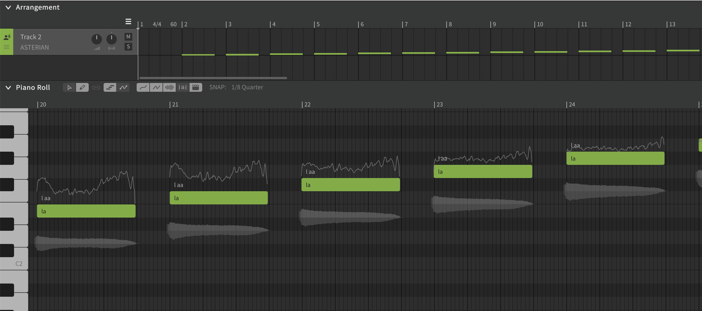
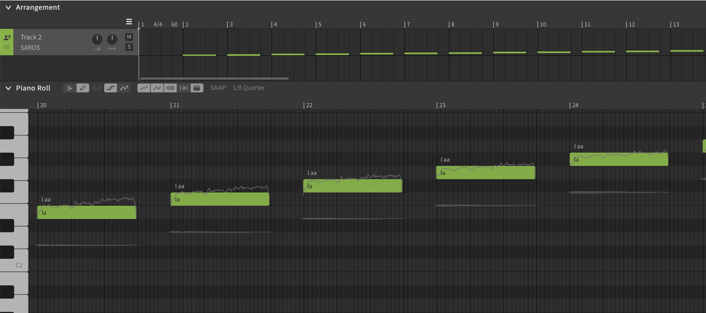

# E2 Intonation comparison Asterian / Saros

While working on a SATB choral piece I discovered something weird with the intonation of the lower notes, e.g. E2.

Astarian (bass) does not seem to have the correct (default) intonation,
the weird thing is that Saros (tenor) does seem to have correct intonation.

This can be seen in the below screenshots:

Asterian:

Saros:

As a result, the lower notes (while using Asterian) require additional manual pitch correction to get it sound correctly.
